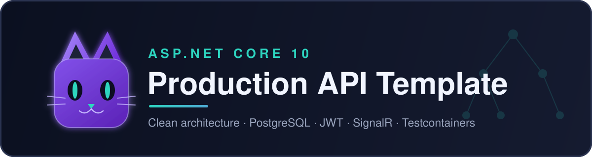
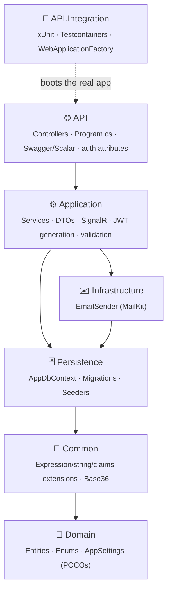
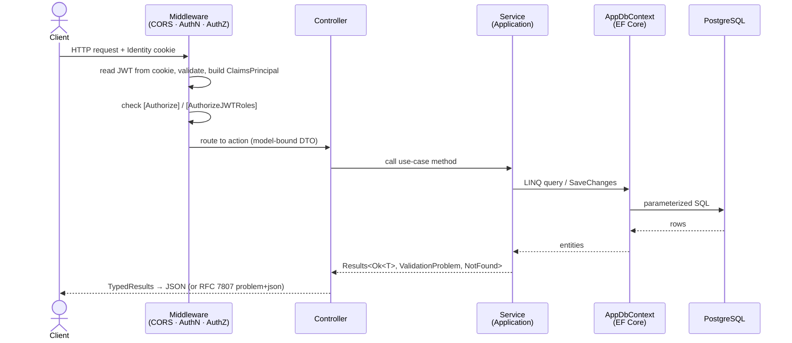
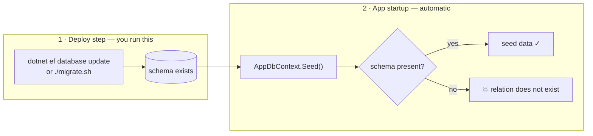
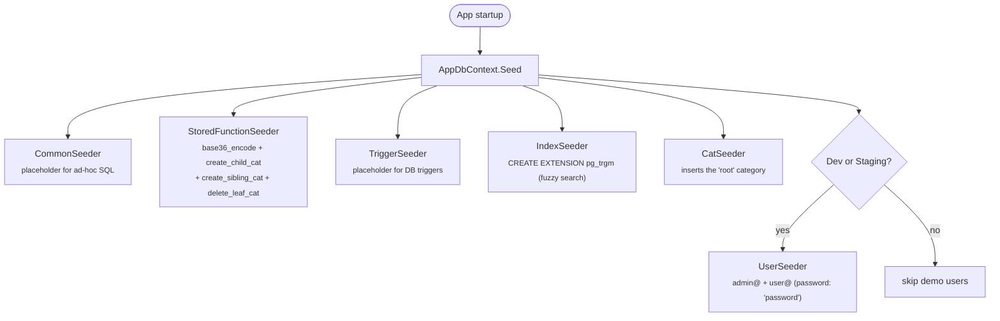
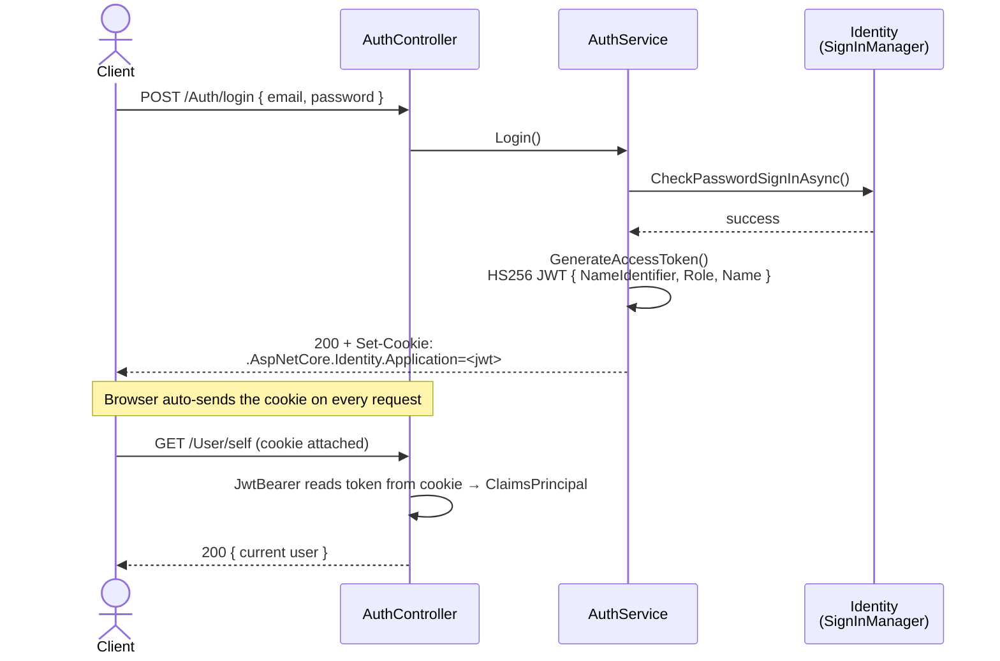
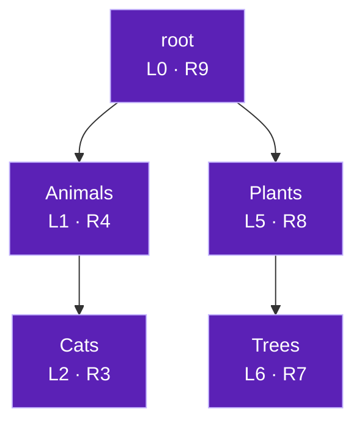
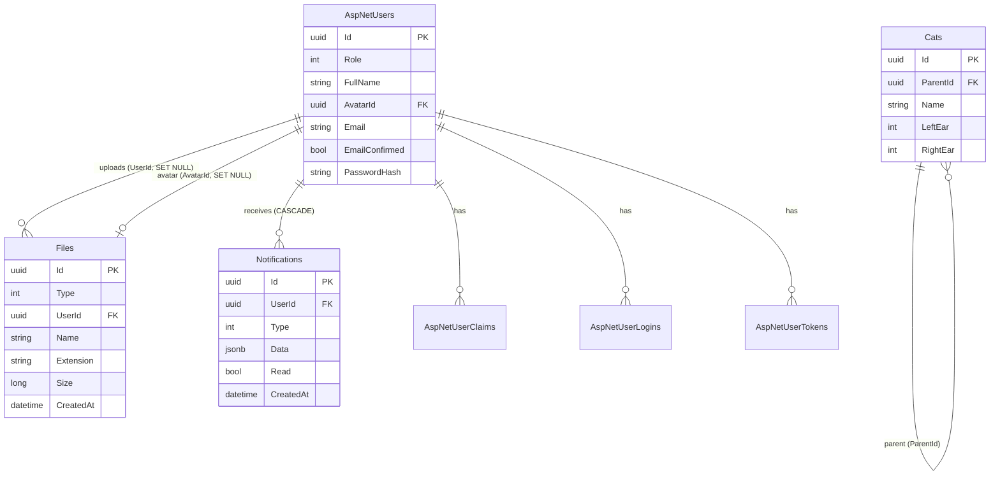
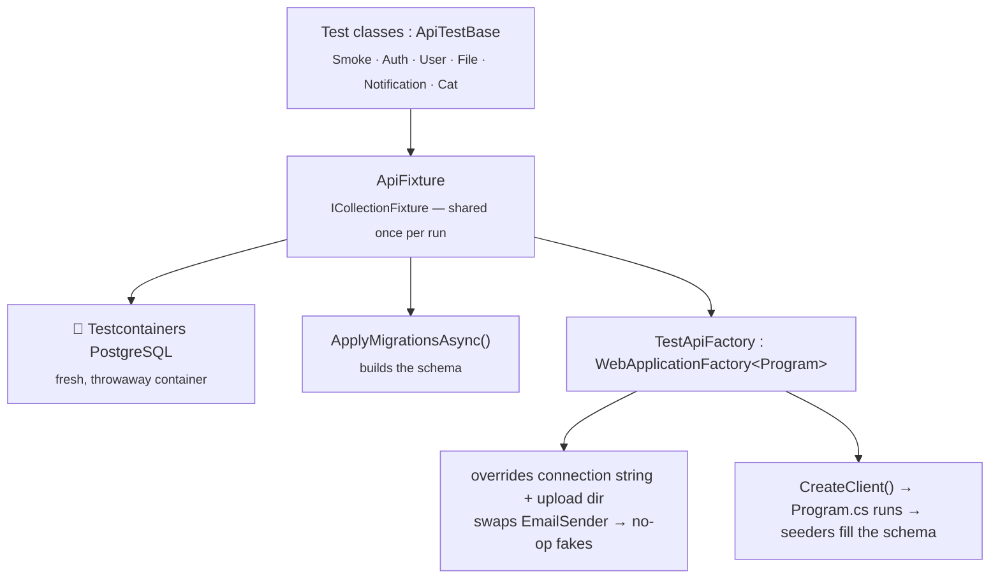

<p align="center">
  
</p>

<h1 align="center">ASP.NET Core 10 — Production API Template</h1>

<p align="center">
  <em>A production-hardened template for an ASP.NET Core 10 API solution.</em><br>
  Clean, layered architecture · PostgreSQL · ASP.NET Identity (JWT-in-cookie) · SignalR · Docker · Testcontainers integration tests.
</p>

<p align="center">
  
  
  
  
  
  
</p>

---

> **New to the project? Read these three sections first:** [Quick Start](#-quick-start) → [How the Layers Fit Together](#-architecture) → [Database & Migrations](#-database--migrations). Everything else is reference material you can dip into when you need it.

## Table of Contents

- [What Is This?](#-what-is-this)
- [Feature Highlights](#-feature-highlights)
- [Tech Stack](#-tech-stack)
- [Quick Start](#-quick-start)
- [Architecture](#-architecture)
- [Project Structure](#-project-structure)
- [Request Lifecycle](#-request-lifecycle)
- [Configuration & `appsettings`](#-configuration--appsettings)
- [Database & Migrations](#-database--migrations)
- [Seeding](#-seeding)
- [Authentication & Authorization](#-authentication--authorization)
- [API Reference](#-api-reference)
- [Cross-Cutting Patterns](#-cross-cutting-patterns)
  - [Keyset Pagination](#keyset-pagination)
  - [Dynamic Search Predicates](#dynamic-search-predicates)
  - [Result Types & DTO Conventions](#result-types--dto-conventions)
  - [File Storage](#file-storage)
  - [Notifications & Realtime (SignalR)](#notifications--realtime-signalr)
  - [The `Cat` Nested-Set Tree](#the-cat-nested-set-tree)
- [Data Model (ER Diagram)](#-data-model-er-diagram)
- [OpenAPI / Scalar / Swagger](#-openapi--scalar--swagger)
- [Integration Testing](#-integration-testing)
- [Docker & Deployment](#-docker--deployment)
- [Using This as a Template](#-using-this-as-a-template)
- [Production Hardening Checklist](#-production-hardening-checklist)
- [Roadmap / Known Gaps](#-roadmap--known-gaps)
- [License](#-license)

---

## 🎯 What Is This?

This is a **starter solution** for building a REST API on **.NET 10**, containing patterns I've been reusing across 10+ real projects. Clone it, rename a few things, and you have a working backend with authentication, a database, file uploads, realtime notifications, auto-generated API docs, and a real integration-test suite — already wired together.

It is opinionated on purpose. Every feature exists so that you can *learn the pattern from a working example* and then copy it for your own entities. The repo ships with one example domain entity — a category tree called **`Cat`** (a pun: each node literally has a `LeftEar` and a `RightEar`) — that demonstrates the trickiest pattern in the codebase end to end.

**Who it's for:** backend developers who want a sane, batteries-included .NET starting point instead of an empty `dotnet new webapi`. The codebase is commented and consistent enough that a junior developer can follow it.

> ⚠️ **"Production-hardened" means the *structure* is production-shaped** — layering, Docker, migrations, tests, non-root containers, problem+json errors. It still ships with **placeholder secrets and demo data you must replace before deploying.** See the [Production Hardening Checklist](#-production-hardening-checklist).

---

## ✨ Feature Highlights

| Area | What you get |
|---|---|
| **Architecture** | 7-project layered / Clean-ish solution with a one-directional dependency graph |
| **Auth** | ASP.NET Core Identity + a self-signed **JWT carried in an HTTP cookie**, role claims, two authorization strategies (token-based and DB-backed) |
| **Database** | PostgreSQL via Npgsql + EF Core 10, code-first migrations, idempotent startup seeders, raw SQL stored functions mapped as EF functions |
| **Pagination** | Cursor-based **keyset pagination** (stable under inserts) with dynamic sort columns |
| **Search** | Type-safe **dynamic query predicates** built from expression trees (string / ordinal / set operators) |
| **Files** | Disk-backed uploads with sharded directories, size/extension validation, avatar handling |
| **Realtime** | SignalR hub pushing typed notifications; notifications persisted as `jsonb` |
| **Docs** | OpenAPI 3 + **Scalar** interactive reference + Swagger JSON, with auth/role annotations and enum descriptions |
| **Testing** | Full-stack integration tests against a **real PostgreSQL in Docker** via Testcontainers |
| **DevOps** | Multi-stage Dockerfile (non-root), per-environment `docker compose` files, migration script |

---

## 🧰 Tech Stack

| Concern | Library / Tool | Version |
|---|---|---|
| Runtime | .NET / ASP.NET Core | `10.0` |
| Language | C# | `13` |
| Database | PostgreSQL | `17.4` |
| ORM | `Npgsql.EntityFrameworkCore.PostgreSQL` | `10.0.2` |
| Identity | `Microsoft.AspNetCore.Identity.EntityFrameworkCore` | `10.0.9` |
| JWT | `Microsoft.AspNetCore.Authentication.JwtBearer` | `10.0.9` |
| Pagination | `MR.AspNetCore.Pagination` | `3.2.0` |
| Realtime | ASP.NET Core SignalR | built-in |
| Email | `NETCore.MailKit` | `2.1.0` |
| API docs | `Swashbuckle.AspNetCore` + `Scalar.AspNetCore` | `10.2.1` / `2.16.3` |
| Tests | `xUnit` + `Microsoft.AspNetCore.Mvc.Testing` + `Testcontainers.PostgreSql` | `2.9.3` / `10.0.3` / `4.10.0` |

---

## 🚀 Quick Start

### Prerequisites

- [.NET 10 SDK](https://dotnet.microsoft.com/download)
- [Docker](https://www.docker.com/) (for PostgreSQL locally **and** for running the integration tests)
- EF Core CLI tools: `dotnet tool install --global dotnet-ef`

### 1. Clone & restore

```bash
git clone <your-fork-url> my-api
cd my-api/src
dotnet restore aspnet10-production-template.slnx
```

### 2. Start a PostgreSQL instance

The fastest path is the bundled compose file, or run any local Postgres you like:

```bash
docker run --name api-pg -e POSTGRES_PASSWORD=postgres -p 5432:5432 -d postgres:17.4-alpine3.21
```

### 3. Point the app at your database

Copy the example config and fill in real values (this file is git-ignored, see [Configuration](#-configuration--appsettings)):

```bash
cp src/API/appsettings.Development.example.json src/API/appsettings.Development.json
```

Set at minimum the `ConnectionStrings:PostgresConnection` and a 32+ character `AppSettings:Authentication:JWTKey`.

### 4. Create the database schema

> 🔴 **This step is mandatory.** The app seeds data at startup but **does not create the schema itself** — you must apply migrations first, or startup will crash with `relation "AspNetUsers" does not exist`.

```bash
cd src
dotnet ef database update --startup-project API --project Persistence
```

### 5. Run

```bash
dotnet run --project API
```

Open the interactive API reference:

- **Scalar:** `http://localhost:5189/scalar/v1`
- **OpenAPI JSON:** `http://localhost:5189/openapi/v1.json`

In `Development`/`Staging` the database is seeded with two accounts you can log in with immediately:

| Email | Password | Role |
|---|---|---|
| `admin@example.com` | `password` | `Admin` |
| `user@example.com` | `password` | `User` |

### 6. Run the tests

```bash
cd src
dotnet test API.Integration   # spins up a throwaway PostgreSQL container; Docker must be running
```

---

## 🏛 Architecture

The solution follows a **layered / Clean-Architecture-inspired** design. Dependencies point in **one direction** — outer layers know about inner layers, never the reverse. This keeps business rules isolated from framework and database concerns and makes the code easy to test.



| Layer | Responsibility | Depends on |
|---|---|---|
| **Domain** | Plain entities (`AppUser`, `File`, `Notification`, `Cat`), enums, and the strongly-typed `AppSettings` POCOs. No business logic. | *(Identity & Npgsql primitives only)* |
| **Common** | Framework-agnostic helpers: expression-tree predicate builders, string/claims/collection extensions, Base36, secure random strings. | Domain |
| **Persistence** | `AppDbContext`, EF Core migrations, seeders, and EF-mapped SQL functions. The only layer that talks SQL. | Common |
| **Infrastructure** | External-world adapters. Today: the MailKit-based `EmailSender`. | Persistence |
| **Application** | Use-cases. Services orchestrate the DbContext + infrastructure, expose DTOs, generate JWTs, and own the SignalR hub. | Infrastructure, Persistence |
| **API** | The thin HTTP edge: controllers, the DI/middleware composition in `Program.cs`, OpenAPI config, authorization attributes. | Application |
| **API.Integration** | Black-box tests that boot the whole API against a real database. | API |

> 📌 **Pragmatic, not dogmatic.** Unlike textbook Clean Architecture, here `Domain` references Identity/Npgsql types and `Application` references `Persistence` directly (there is no separate repository abstraction — EF Core's `DbContext` *is* the unit-of-work/repository). This is a deliberate trade-off that keeps the template small. If you need stricter boundaries, introduce repository interfaces in `Application` and implement them in `Persistence`.

---

## 📁 Project Structure

```
aspnet10-production-template/
├─ assets/logo.svg
├─ docker-compose.Development.yaml      # nginx serving /Uploads (+ optional db)
├─ docker-compose.Staging.yaml          # api + db + mounted appsettings.Staging.json
├─ docker-compose.Production.yaml       # api + db, bound to 127.0.0.1 (reverse-proxy in front)
├─ migrate.sh                           # interactive `dotnet ef database update` for Staging/Prod
└─ src/
   ├─ aspnet10-production-template.slnx  # the solution file (new XML .slnx format)
   ├─ Dockerfile                         # multi-stage, non-root final image
   ├─ Domain/
   │  ├─ Models/        AppUser, File, Notification, Cat, AppSettings
   │  └─ Enum/          Role, FileType, NotificationType, SortOrder, (Common.Enum: StringOp/OrdinalOp/SetOp)
   ├─ Common/
   │  ├─ Extensions/    PredicateExtensions (⭐ expression-tree search), ClaimsPrincipialExt, ...
   │  └─ Helpers/       Base36, SecureRandomStringGenerator
   ├─ Persistence/
   │  ├─ AppDbContext.cs          # IdentityUserContext + DbSets + EF-mapped SQL functions
   │  ├─ Migrations/              # code-first EF migrations
   │  └─ Seeders/                 # StoredFunction / Index / Cat / User / Common / Trigger
   ├─ Infrastructure/
   │  └─ EmailSender/             # MailKit implementation behind IEmailSender
   ├─ Application/
   │  ├─ Services/      AuthService, UserService, FileService, NotificationService, CatService
   │  ├─ DTO/           per-feature Get/Create/Update DTOs + Search models
   │  └─ SignalR/       MainHub + IMainHub
   ├─ API/
   │  ├─ Program.cs                # composition root (DI + middleware)
   │  ├─ Controllers/   Api, Auth, User, File, Notification, Cat
   │  ├─ Helpers/       AuthorizeJWTRolesAttribute, AuthorizeDBRolesAttribute
   │  └─ Extensions/    SortExt (⭐ keyset sort builder), Swagger filters, enum descriptions
   └─ API.Integration/
      ├─ Infrastructure/  ApiFixture, TestApiFactory, ApiTestBase
      └─ Tests/           Smoke, Auth, User, File, Notification, Cat controller tests
```

---

## 🔄 Request Lifecycle

What happens on a typical authenticated request:



The composition root is [`src/API/Program.cs`](src/API/Program.cs). It registers (in order): controllers + JSON options, `AppSettings` binding, OpenAPI, pagination, JWT authentication, Identity, Swagger/Scalar, MailKit, the data + application services, SignalR. Then it **seeds the database**, wires the dev-only docs UI, CORS, the SignalR hub endpoint, authorization, and controllers.

---

## ⚙️ Configuration & `appsettings`

Configuration is environment-driven. ASP.NET loads `appsettings.json` then `appsettings.{ASPNETCORE_ENVIRONMENT}.json` on top.

### The committed vs. real files

| File | Committed? | Purpose |
|---|---|---|
| `appsettings.{Env}.example.json` | ✅ yes | **Templates.** Copy them, never put real secrets here. |
| `appsettings.{Env}.json` | ❌ git-ignored | **Your real config** with connection strings, JWT keys, SMTP creds. |

Create your working config by copying an example:

```bash
cp src/API/appsettings.Development.example.json src/API/appsettings.Development.json
```

### The settings shape

Everything under `AppSettings` is bound to strongly-typed POCOs ([`Domain/Models/AppSettings.cs`](src/Domain/Models/AppSettings.cs)) via `builder.Services.Configure<AppSettings>(...)` and injected as `IOptions<AppSettings>`. Missing/invalid sections fail fast at startup.

```jsonc
{
  "ConnectionStrings": {
    // The app reads this key by name everywhere.
    "PostgresConnection": "Host=localhost;Port=5432;Database=my-api;Username=postgres;Password=...;Include Error Detail=true"
  },
  "AppSettings": {
    "UploadPath": "./Uploads",                 // where uploaded files land on disk
    "Authentication": {
      "JWTIssuer":  "my-api",
      "JWTAudience": "my-api",
      "JWTKey": "<at least 32 characters - keep secret>",
      "BearerTokenExpiration": 31556952,        // seconds (this default ≈ 1 year — see hardening checklist)
      "RefreshTokenExpiration": 31556952
    },
    "SMTP": {
      "Host": "smtp.gmail.com", "Port": 465,
      "Login": "...", "Password": "...",
      "SenderName": "My API", "SenderEmail": "noreply@example.com"
    }
  }
}
```

### Secrets

- **Local dev:** the API project has a `UserSecretsId`, so you can use `dotnet user-secrets set "AppSettings:Authentication:JWTKey" "..."` instead of editing files.
- **Containers:** `docker compose` mounts the real `appsettings.{Env}.json` into the image read-only (see [Docker](#-docker--deployment)). Connection strings/secrets can also be supplied as environment variables (`ConnectionStrings__PostgresConnection=...`).

---

## 🗄 Database & Migrations

The data layer is EF Core 10 on PostgreSQL. [`AppDbContext`](src/Persistence/AppDbContext.cs) extends `IdentityUserContext<AppUser, Guid, ...>`, so all the ASP.NET Identity tables come for free, plus the app's own `DbSet`s: `Files`, `Cats`, `Notifications`.

### ⚠️ Migrations are applied separately from startup

This is the single most important operational fact in the template:



`Program.cs` runs the **seeders** at startup but never calls `Database.Migrate()`. So your deploy pipeline (or you, locally) must apply migrations **before** the app boots.

### Common EF commands

All commands run from `src/`, with `API` as the startup project and `Persistence` holding the migrations:

```bash
# Apply all pending migrations to the dev database
dotnet ef database update --startup-project API --project Persistence

# Create a new migration after changing an entity
dotnet ef migrations add AddWidgetTable --startup-project API --project Persistence

# Roll back to a specific migration
dotnet ef database update <MigrationName> --startup-project API --project Persistence

# Generate an idempotent SQL script for production (no live DB connection needed)
dotnet ef migrations script --idempotent --startup-project API --project Persistence -o migrate.sql
```

For Staging/Production there is a helper, [`migrate.sh`](migrate.sh), that runs `dotnet ef database update` against the right host/port with an environment picker.

### EF-mapped SQL functions

Some logic lives in the database as PL/pgSQL functions and is mapped into LINQ via `modelBuilder.HasDbFunction(...)`:

```csharp
builder.HasDbFunction(() => CreateChildCat(default, default)).HasName("create_child_cat");
builder.HasDbFunction(() => CreateSiblingCat(default, default)).HasName("create_sibling_cat");
```

The function **bodies** are installed by `StoredFunctionSeeder` at startup (see [Seeding](#-seeding)). This is the pattern to follow when a relational operation is far cheaper or safer in SQL than in C# — see [the Cat tree](#the-cat-nested-set-tree).

---

## 🌱 Seeding

`AppDbContext.Seed()` is invoked once at startup from `Program.cs`. Every seeder is **idempotent** (guarded by `AnyAsync()`, `CREATE OR REPLACE`, or `IF NOT EXISTS`), so booting repeatedly is safe.



Each seeder implements the `ISeeder` contract (a `static abstract Task seed(...)`). To add your own seed data, create a class implementing `ISeeder` and call it from `AppDbContext.Seed`. Keep it idempotent.

---

## 🔐 Authentication & Authorization

### The model: a JWT carried in a cookie

This template uses ASP.NET Core Identity for user/password management, but instead of returning a bearer token in the response body, **login mints a signed JWT and stores it in an HTTP cookie** named `.AspNetCore.Identity.Application`. The `JwtBearer` handler is configured to read the token *from that cookie* (or from an `access_token` query-string parameter for SignalR connections).



Why a cookie? It works seamlessly with browsers (no manual `Authorization` header), and `HttpOnly`/`SameSite`/`Secure` flags are tuned **per environment and request origin** in `AuthService.LoginCokkie(...)`. CORS is configured with `AllowCredentials()` plus an explicit origin allow-list so the cookie flows cross-site safely.

The JWT carries three claims: `NameIdentifier` (the user's `Guid`), `Role` (`Admin`/`User`), and `Name`.

### Two ways to authorize

| Attribute | How it decides | When to use |
|---|---|---|
| `[Authorize]` | Any authenticated user (valid cookie). | Endpoints that only need a logged-in user. |
| **`[AuthorizeJWTRoles(Role.Admin)]`** | Reads the `Role` **claim from the JWT**. Fast, no DB hit. | Default for role-gated endpoints. |
| `[AuthorizeDBRoles(Role.Admin)]` | Looks the user up in the database and checks the live `Role` column via an `IAsyncAuthorizationFilter`. | When a token might be stale (e.g. a user was just demoted) and you need the authoritative role. |

Both role attributes return **`403 Forbidden`** when the role doesn't match and **`401 Unauthorized`** when there's no valid identity.

Inside controllers, the current user is read through extension methods on `ClaimsPrincipal`:

```csharp
User.Uuid();    // the user's Guid (from the NameIdentifier claim)
User.Roles();   // IEnumerable<Role> parsed from Role claims
```

> ℹ️ Identity is configured with **relaxed password rules** (min length 8, no complexity requirement) and `RequireConfirmedEmail = false` for developer convenience. Tighten both before production. Custom, localized (Russian) Identity error messages live in `CustomIdentityErrorDescriber`.

---

## 📚 API Reference

All controllers are attribute-routed at `/[controller]`. Auth column: 🌐 public · 🔑 any authenticated user · 👑 Admin only.

<details open>
<summary><strong>/Auth</strong> — registration, login, password & email management</summary>

| Method | Route | Auth | Description |
|---|---|---|---|
| `POST` | `/Auth/register/user` | 🌐 | Self-registration; returns the new user `Guid`. |
| `POST` | `/Auth/login` | 🌐 | Validates credentials, sets the auth cookie. |
| `POST` | `/Auth/logout` | 🔑 | Clears the auth cookie. |
| `GET`  | `/Auth/confirm_email` | 🌐 | Confirms an email from a tokenized link. |
| `POST` | `/Auth/resend_confirmation_email` | 🌐 | Re-sends the confirmation link. |
| `POST` | `/Auth/forgot_password` | 🌐 | Emails a reset code (never reveals if the email exists). |
| `POST` | `/Auth/reset_password` | 🌐 | Resets the password with a code. |
| `PATCH`| `/Auth/manage/credentials` | 🔑 | Change own email and/or password. |

</details>

<details>
<summary><strong>/User</strong> — user administration & self-service</summary>

| Method | Route | Auth | Description |
|---|---|---|---|
| `GET`  | `/User` | 👑 | Paginated, searchable, sortable list of users. |
| `GET`  | `/User/self` | 🔑 | The current user's profile. |
| `PUT`  | `/User/self/basic` | 🔑 | Update own name/phone. |
| `GET`  | `/User/{uuid}` | 👑 | Fetch any user. |
| `POST` | `/User/User` · `/User/Admin` | 👑 | Create a `User` / `Admin` (auto-generates a password if omitted and emails credentials). |
| `PUT`  | `/User/User/{uuid}` · `/User/Admin/{uuid}` | 👑 | Update a user/admin. |
| `PATCH`| `/User/{uuid}/credentials` | 👑 | Change a user's email, password, and/or role. |
| `DELETE`| `/User/{uuid}?delete_files=` | 👑 | Delete a user (optionally their uploaded files). |

</details>

<details>
<summary><strong>/File</strong> — uploads & avatars</summary>

| Method | Route | Auth | Description |
|---|---|---|---|
| `GET`  | `/File` | 🔑 | Paginated files. Non-admins only ever see their **own** files (enforced server-side). |
| `POST` | `/File/{type}` | 👑 | Upload a file of a given `FileType` (images ≤ 2 MB; `UserAvatar` is rejected here). |
| `PUT`  | `/File/self/avatar` | 🔑 | Set or clear the current user's avatar. |
| `DELETE`| `/File/{uuid}` | 🔑 | Delete a file — allowed for the owner or an admin. |

</details>

<details>
<summary><strong>/Notification</strong> — per-user notifications</summary>

| Method | Route | Auth | Description |
|---|---|---|---|
| `GET`  | `/Notification/my` | 🔑 | Paginated notifications for the current user. |
| `GET`  | `/Notification/{uuid}` | 🔑 | A single notification (scoped to the caller). |
| `POST` | `/Notification/read/{read}` | 🔑 | Mark a set of notification IDs read/unread. |
| `DELETE`| `/Notification/{uuid}` | 🔑 | Delete one of the caller's notifications. |
| `GET`  | `/Notification/.doc/{type}` | 🌐 | **Doc-only stub** — see [Notifications](#notifications--realtime-signalr). |

</details>

<details>
<summary><strong>/Cat</strong> — the example category tree</summary>

| Method | Route | Auth | Description |
|---|---|---|---|
| `GET`  | `/Cat` | 🌐 | Paginated/searchable flat list of categories. |
| `GET`  | `/Cat/family?root_id=&max_depth=6` | 🌐 | Subtree as a nested structure. |
| `GET`  | `/Cat/breadcrumbs?cat_id=` | 🌐 | Path from the root to a node. |
| `GET`  | `/Cat/{uuid}` | 🌐 | A single category. |
| `POST` | `/Cat/{uuid}` | 👑 | Create a child under the given parent. |
| `PUT`  | `/Cat/{uuid}` | 👑 | Rename a category. |
| `DELETE`| `/Cat/{uuid}?recursive=` | 👑 | Delete a node (roots are protected; non-empty nodes need `recursive=true`). |

</details>

<details>
<summary><strong>/</strong> & SignalR</summary>

| Method | Route | Auth | Description |
|---|---|---|---|
| `GET`  | `/` | 🌐 | Build/version info (hidden from OpenAPI). The build date is derived from the auto-incrementing assembly version. |
| WS     | `/hubs/MainHub` | 🔑 | SignalR hub. Authenticated via `access_token` query parameter. |

</details>

---

## 🧩 Cross-Cutting Patterns

These are the reusable patterns you'll copy when adding your own features.

### Keyset Pagination

List endpoints use **cursor (keyset) pagination** via `MR.AspNetCore.Pagination`, which is stable when rows are inserted/deleted (unlike offset paging). The clever part is [`SortExt.ToExpression<T>()`](src/API/Extensions/SortExt.cs): it converts a simple `SortModel` query (`?SortBy=Name&SortOrder=Asc`) into a `KeysetPaginationBuilder` configuration via **runtime expression trees** — including support for nested property paths (`SortBy=User.FullName`). It defaults to the entity's `Id` and always appends `Id` as a tie-breaker for a total ordering.

```csharp
await pagination.KeysetPaginateAsync(
    service.All().Where(search.ToPredicate()),       // filtered IQueryable
    sort.ToExpression<Cat>().Compile(),              // dynamic ORDER BY
    async uuid => await service.Find(new Guid(uuid)),// resolve the cursor row
    q => q.Select(e => GetCatDTO.FromEntity(e)));    // project to DTO
```

### Dynamic Search Predicates

Every list endpoint takes a `…SearchModel` whose `ToPredicate()` builds an `Expression<Func<T,bool>>` that EF Core translates straight to SQL. The heavy lifting is in [`Common/Extensions/PredicateExtensions.cs`](src/Common/Extensions/PredicateExtensions.cs), which provides composable, type-safe operators:

| Operator family | Enum | Examples |
|---|---|---|
| String | `StringOp` | `Equals`, `Contains`, `StartsWith`, `EndsWith`, `IsEmpty`, … (case-insensitive) |
| Ordinal | `OrdinalOp` | `GreaterThan`, `LessThanOrEqual`, `Equal`, … |
| Set | `SetOp` | `Subset`, `Intersect`, `Empty`, `NotEmpty` |

```csharp
public Expression<Func<Cat, bool>> ToPredicate() {
    Expression<Func<Cat, bool>> p = c => true;
    if (Name is not null && NameOp is StringOp op)
        p = p.StringOp(op, c => c.Name, Name);          // composes with .And(...)
    if (LeftEar is int v && LeftEarOp is OrdinalOp o)
        p = p.OrdinalOp(o, c => c.LeftEar, v);
    return p;
}
```

The query parameters self-document in Scalar (note the 🔍/📈 emoji legend in the OpenAPI descriptions), and `pg_trgm` is enabled for fuzzy/trigram matching.

### Result Types & DTO Conventions

Services return ASP.NET Core's **typed result unions** rather than throwing for control flow:

```csharp
Task<Results<Ok<AppUser>, ValidationProblem, NotFound>> UpdateCredentials(...);
```

Controllers pattern-match the union into HTTP responses with `TypedResults`:

```csharp
=> (await service.UpdateCredentials(uuid, request)).Result switch {
    Ok<AppUser> { Value: var x } => TypedResults.Ok(GetUserBasicDTO.FromEntity(x!)),
    ValidationProblem p          => p,   // → 400 RFC 7807 problem+json
    NotFound n                   => n,   // → 404
};
```

Validation failures are turned into `problem+json` by the `Validation.CreateValidationProblem(...)` helper. DTOs follow a consistent naming convention:

- `GetXDTO.FromEntity(entity)` — entity → response DTO (static projection)
- `CreateXDTO.ToEntity()` — request DTO → new entity
- `UpdateXDTO.UpdateEntity(entity)` — apply a request onto an existing entity

DTOs also use inheritance to avoid repetition (e.g. `CreateUserDTO : UpdateUserDTO`, `GetUserExtDTO : GetUserBasicDTO`).

### File Storage

Uploaded files are written to disk under `AppSettings:UploadPath`, **sharded** into sub-directories to avoid huge flat folders. The directory is `"{FileType}/{lastByteOfGuidAsHex}"` and the physical name is `"{Guid}.{ext}"` (computed properties on the [`File`](src/Domain/Models/File.cs) entity). Uploads are validated for size and extension; the DB stores only metadata (type, size, owner, name, extension). On Linux, file permissions are set explicitly (guarded by the `LINUX` compile constant set in the Dockerfile). Files are intended to be served by a reverse proxy at `/Uploads/...` (nginx in the compose files), not by the API itself.

### Notifications & Realtime (SignalR)

Notifications are persisted with their payload stored as PostgreSQL **`jsonb`** (`Data: JsonDocument`) and typed by the `NotificationType` enum. `NotificationService.Create()` saves the row **and** pushes it live to the recipient over SignalR:

```csharp
await ws.Clients.User(userId).New(GetNotificationDTO.FromEntity(entity));
```

The hub `MainHub : Hub<IMainHub>` is `[Authorize]`d and exposed at `/hubs/MainHub`. The strongly-typed client interface `IMainHub` defines the server→client methods.

**The `.doc` pattern:** because the payload is loosely-typed `jsonb`, the API can't infer each notification's schema automatically. So `NotificationController` exposes documentation-only endpoints like `GET /Notification/.doc/UserRegistered` that `throw new NotImplementedException()` — they exist purely so OpenAPI/SignalRSwaggerGen emit a typed schema (`NotificationDocProjection<UserRegisteredNotification>`) that documents what each notification type's `Data` looks like.

### The `Cat` Nested-Set Tree

`Cat` is the template's showcase entity: a category tree stored with the **nested-set model**. Each node has a `LeftEar` and `RightEar` (the pun: cat ears = the left/right bounds). A node's descendants are exactly the rows whose bounds fall *inside* its own — so an entire subtree is a single indexed range query, with no recursion.



> "All descendants of *Animals*" = `WHERE LeftEar BETWEEN 1 AND 4`. `HasChildren()` is simply `RightEar - LeftEar > 1`; `ChildCount()` is `(RightEar - LeftEar) / 2`.

Keeping those bounds consistent during inserts/deletes requires shifting many rows atomically, which is far cheaper in SQL — so it's done by the PL/pgSQL functions `create_child_cat`, `create_sibling_cat`, and `delete_leaf_cat` (installed by `StoredFunctionSeeder`, mapped via `HasDbFunction`, and wrapped by `CatService`). `CatService.Family()` / `Breadcrumbs()` then read the tree back using recursive LINQ projections. This is a complete, working example of mixing raw SQL with EF Core when the relational model demands it.

---

## 🧮 Data Model (ER Diagram)



`AspNetUserClaims`, `AspNetUserLogins`, and `AspNetUserTokens` are the standard ASP.NET Identity tables (created automatically by `IdentityUserContext`). Note the deliberate cycle between `AspNetUsers` and `Files`: a user *uploads* many files, and a user's *avatar* is one of those files — both foreign keys use `SET NULL` to avoid delete conflicts.

---

## 📖 OpenAPI / Scalar / Swagger

In `Development` and `Staging`, three things are wired up:

- **`MapOpenApi()`** — the .NET 10 built-in OpenAPI document.
- **Scalar** — a modern interactive API reference at **`/scalar/v1`**.
- **Swagger JSON** — served at **`/openapi/{documentName}.json`** (Swashbuckle), used to enrich the docs.

The docs are enhanced by custom filters in [`API/Extensions/Swagger.cs`](src/API/Extensions/Swagger.cs) and `DescribeEnumMemberValues.cs`:

- 🈲 endpoints display their required **roles/policies** in the summary.
- Enums render their `[Description]` text inline (e.g. `Admin = Администратор`).
- SignalR hub methods are documented via `SignalRSwaggerGen`.

These docs UIs are **disabled in Production** by design.

---

## 🧪 Integration Testing

The `API.Integration` project runs **black-box tests against the real application and a real PostgreSQL database** — no mocks, no in-memory provider. It uses `WebApplicationFactory<Program>` to host the API in-process and **Testcontainers** to spin up a disposable `postgres:17.4-alpine3.21` container per test run.



Key pieces:

- **`ApiFixture`** — starts the container, creates a temp upload directory, applies migrations, then triggers app startup (which seeds data). Shared across the whole `[Collection]` so the expensive container starts once.
- **`TestApiFactory`** — overrides the connection string + upload path and replaces the SMTP-bound email senders with no-op fakes so tests need no mail server. (The `API` project exposes its internal `Program` to the test project via `InternalsVisibleTo`.)
- **`ApiTestBase`** — shared helpers: cookie-aware `HttpClient`s, `LoginAdminAsync()`/`LoginUserAsync()`, JSON options that relax `required` on read, and `ReadAsync<T>()`/`FirstPageItemAsync<T>()`.

Writing a new test is then trivial:

```csharp
public class CatControllerTests(ApiFixture fixture) : ApiTestBase(fixture) {
    [Fact]
    public async Task Create_forbidden_for_non_admin() {
        var client = await LoginUserAsync();
        var root = await GetRootAsync(client);
        var response = await client.PostAsJsonAsync($"/Cat/{root.Id}",
            new UpdateCat { Name = "nope" }, JsonOptions);
        Assert.Equal(HttpStatusCode.Forbidden, response.StatusCode);
    }
}
```

Run them with:

```bash
cd src
dotnet test API.Integration          # Docker must be running
```

> The suite currently has **39 tests** covering smoke/startup, auth, users, files, notifications, and the full `Cat` tree (CRUD, tree queries, and authorization).

---

## 🐳 Docker & Deployment

### Dockerfile

[`src/Dockerfile`](src/Dockerfile) is a standard **multi-stage** build:

1. `sdk:10.0` restores + builds + publishes (with `DefineConstants=LINUX` to enable Unix file-permission handling).
2. `aspnet:10.0` is the slim runtime image.
3. The final stage runs as a **non-root `app` user** with the published output `chown`ed to it.

### Compose files (one per environment)

| File | Contents | Notes |
|---|---|---|
| `docker-compose.Development.yaml` | `nginx` serving `./Uploads` as static files (db commented out) | Run the API from your IDE against a local/containerised DB. |
| `docker-compose.Staging.yaml` | `api` + `postgres`, mounts `appsettings.Staging.json` read-only | DB on `127.0.0.1:3001`, API on `:3000`. |
| `docker-compose.Production.yaml` | `api` + `postgres`, `restart: always` | API bound to `127.0.0.1:3002` and DB to `127.0.0.1:3003` — intended to sit **behind a reverse proxy** (e.g. nginx/Caddy for TLS). |

```bash
docker compose -f docker-compose.Production.yaml up -d --build
# then apply migrations against the now-running database:
./migrate.sh        # pick "Production"
```

> ⚠️ The compose files use `POSTGRES_HOST_AUTH_METHOD=trust` and bind Postgres to `127.0.0.1` only. That's acceptable for a single-host setup behind a firewall, but **set a real password** and review network exposure for anything internet-facing.

---

## 🧬 Using This as a Template

When you clone this for a new project, work through this rename checklist:

- [ ] Rename the solution file `src/aspnet10-production-template.slnx` and the namespaces/assembly (`API`, etc.) to your project's name.
- [ ] Replace the database names `newproject-*` in every `appsettings.*.json` and `docker-compose.*.yaml`.
- [ ] Generate a fresh, secret **`JWTKey`** (32+ chars) and set `JWTIssuer`/`JWTAudience`.
- [ ] Update the **CORS origin allow-list** in `Program.cs` (currently `domain.com` / `domain.dev` / `domain.internal`) and the cookie domains in `AuthService.LoginCokkie(...)`.
- [ ] Replace placeholder branding: the hard-coded sender name in `UserService` (`"…NewProject.com"`) and `"domain.com"` SMTP sender.
- [ ] Decide on your **example domain**: keep `Cat` as a reference or delete it (entity, DTOs, controller, service, seeder, the SQL functions, the `Cat` migration, and its tests).
- [ ] Localize or translate the Russian user-facing strings (`CustomIdentityErrorDescriber`, endpoint descriptions, emails) if your audience differs.
- [ ] Work through the [Production Hardening Checklist](#-production-hardening-checklist) below.

---

## 🔒 Production Hardening Checklist

The architecture is production-shaped, but these defaults are tuned for developer convenience and **must** be reviewed before you ship:

- [ ] **JWT lifetime** — `BearerTokenExpiration` defaults to ~1 year. Shorten it and implement refresh if needed.
- [ ] **Cookie flags** — the auth cookie is `HttpOnly = false` in several branches (so JS can read it). Set `HttpOnly = true` + `Secure = true` + an appropriate `SameSite` for your deployment.
- [ ] **Password policy** — Identity is configured with no complexity requirements and `RequireConfirmedEmail = false`. Re-enable both.
- [ ] **Database auth** — replace `POSTGRES_HOST_AUTH_METHOD=trust` with real credentials; don't expose Postgres beyond the host.
- [ ] **Secrets** — never commit real `appsettings.{Env}.json`; inject via environment variables or a secrets manager.
- [ ] **TLS** — terminate HTTPS at a reverse proxy in front of the production container.
- [ ] **Migrations** — ensure your deploy pipeline runs migrations *before* the app starts (the app will crash on a missing schema).
- [ ] **`NuGetAudit`** — it's disabled (`false`) across projects to keep the template quiet; re-enable to get vulnerability warnings.
- [ ] **CORS** — confirm the origin allow-list matches your real front-ends; never combine `AllowAnyOrigin` with `AllowCredentials`.

---

## 🗺 Roadmap / Known Gaps

A few things are intentionally stubbed or left as exercises (you'll find them commented out in the code):

- **`AuthorizeDBRoles`** is implemented but not used on any endpoint — wire it in where stale tokens are a concern.
- **Role-as-Identity-roles** is commented out in favour of a simple `Role` enum column; switch to `AddRoles<AppRole>()` if you need many/dynamic roles.
- **`CommonSeeder` / `TriggerSeeder`** are empty placeholders ready for your ad-hoc SQL / triggers.
- **Bulk operations** (e.g. moving products between categories) are sketched in comments in `CatService`.
- **Multi-language notifications** — an `X-LANG` header helper exists (`HttpContrxtExt.Lang`) but isn't fully plumbed.

---

## 📄 License

No license file ships with this template — **add your own `LICENSE`** before publishing. Until then, all rights are reserved by default.

---

<p align="center"><sub>Built with .NET 10 · Generated documentation — review and adapt for your project.</sub></p>
